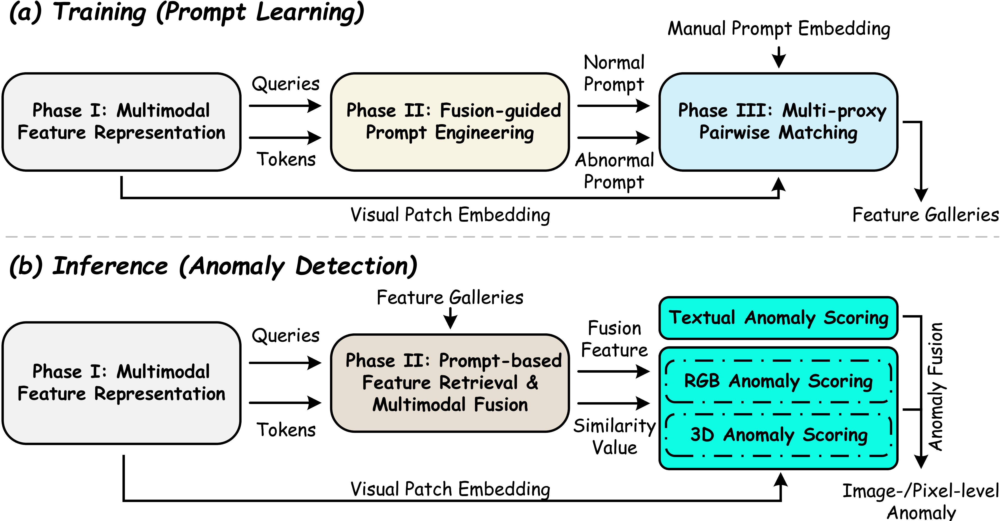
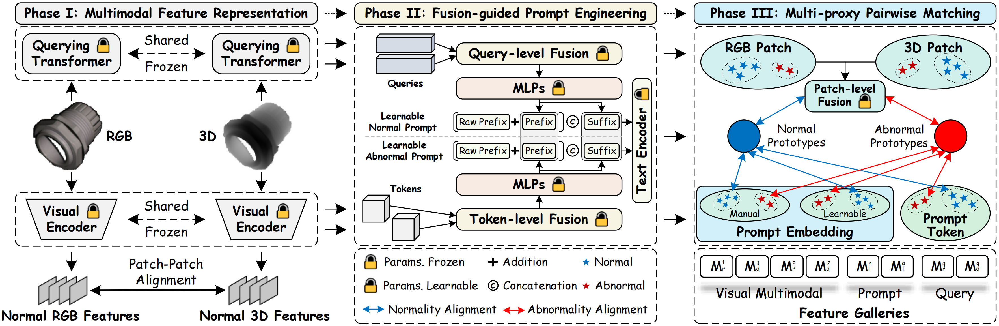

# [Unified Multimodal Industrial Anomaly Detection via Few Normal Samples](https://github.com/SvyJ/UniMF)

[](https://pytorch.org/get-started/locally/)
[](https://www.python.org)
[](LICENSE)


<hr style="border: 2px solid gray;"></hr>

- [2026/04/14] 🌟 The source codes have been released.
- [2026/04/02] 🎉 Our article is accepted by *IEEE Transactions on Industrial Informatics (T-II)*.

<hr style="border: 2px solid gray;"></hr>

## Overview of UniMF



## Download Dataset

- Download the MVTec 3D-AD dataset [here](https://www.mvtec.com/company/research/datasets/mvtec-3d-ad) and decompress it, keep the source folder structure unchanged
- Specify the dataset path `data_path` in `test.sh`

## Evaluation

```bash
bash test.sh
```

## Citation

```tex
@article{jiang2026unified,
  title={Unified Multimodal Industrial Anomaly Detection via Few Normal Samples},
  author={Jiang, Shuai and Ma, Yunfeng and Zhou, Jingyu and Wang, Yaonan and Liu, Min},
  journal={IEEE Transactions on Industrial Informatics},
  year={2026},
  publisher={IEEE}
}
```

## Thanks

Our repository is built on excellent works include  [PromptAD](https://github.com/FuNz-0/PromptAD), [CLIPAD](https://github.com/ByChelsea/CLIP-AD), and [WinCLIP](https://github.com/caoyunkang/WinClip).
